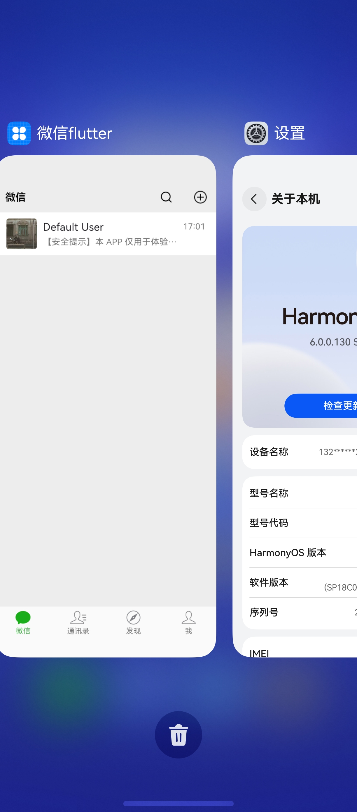
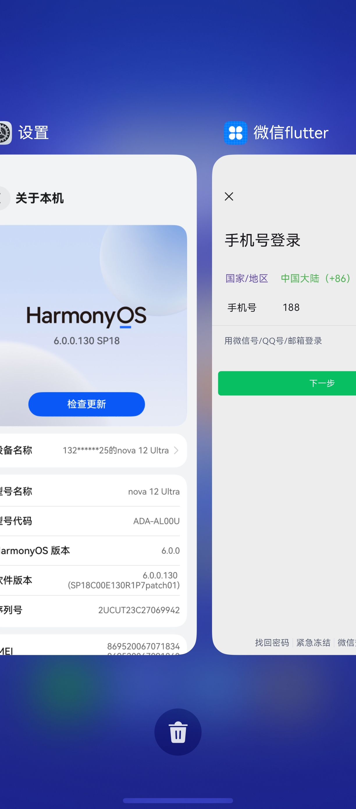
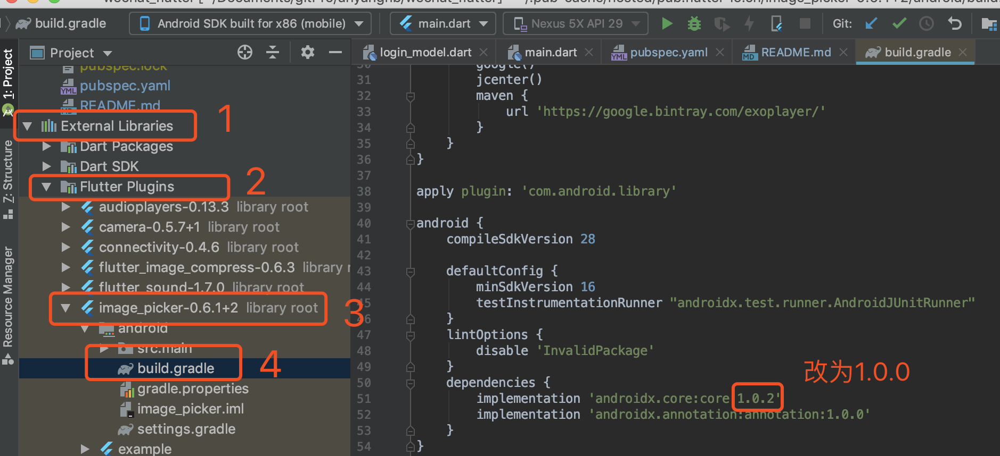
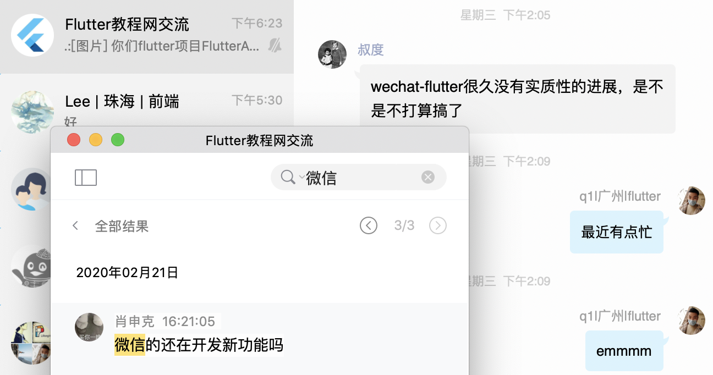

[](https://github.com/fluttercandies/wechat_flutter/stargazers)
[](https://github.com/fluttercandies/wechat_flutter/network)
[](https://github.com/fluttercandies/wechat_flutter/issues)


> 如果产生其他依赖无法编译的问题，可以尝试将`pubspec.yaml`中的`dependencies`中的所有依赖的"^"去掉或者插件版本号改为any，重新编译尝试。
> 还是出错的话在项目主目录执行`flutter clean`再重新运行。
> 如果出现插件版本不适配记得看`pubspec.yaml`文件介绍的插件flutter版本是否与自己本地Flutter适配。

# 相关文档
[问题列表与解决方案](issues_list.md)

# 课程说明
本项目出配套课程啦，耗时6个月打造，flutter3最新版本，从0到1实现微信，包含im聊天单聊群聊功能：https://edu.csdn.net/course/detail/39189

课程demo下载地址 https://wwpj.lanzouu.com/s/wechat-new-demo

商务合作联系微信【q1666655】，定制开发、帮面试、出技术方案、解决Apple Store上架4.3问题.

Business DM to Telegram: @ahyangnb_1

# HarmonyOS Next 6.0 【纯血鸿蒙Next6.0】

||  | |
| --- | --- | --- |

# 赞助

开源不容，买杯咖啡给我点支持，我的想法是完整实现音视频通话和语音房以及直播，在此项目，给我点动力吧。


# log

* 2026.03.07 完整兼容纯血鸿蒙6.0 Next系统. (在 [pubspec.yaml](pubspec.yaml) 搜索 "鸿蒙专属") (flutter 3.27.5-ohos-1.0.4)

* 2024.12.16 兼容 flutter 3.24.3【所有插件版本最新】

* 2023.12.28 兼容 flutter 3.0.5 版本 和 Android sdk 33【android 13】.

* 2022.06.28 更换纯ui分支模拟图片地址 【12:00】
  
* 2022.06.28 创建纯ui分支【10:00】
  
* 2022.05.28 更新环境信息与贴出`问题列表与解决方案`索引
  
* 2022.05.26 开始兼容flutter2.10.4

* 2022.05.26 列出错误列表及修复方式

* 2022.05.15 修复补Android安装包链接和二维码

* 2021.11.08 适配flutter 2.5

* 2021.05.12 适配iOS，解决运行问题

* 2021.05.10 适配 Flutter2 稳定分支 【11:45】

* 2021.05.10 修复im插件例子不能获取依赖、修复`lib/ui/flutter/my_cupertino_dialog.dart`【】

* 2021.01.16 新增支付页面，等待图标补全 【14:49】

* 2021.01.16 适配Flutter (Channel stable, 1.22.5)

* 2020.08.25 适配Flutter (Channel stable, 1.20.2)

* 2020.07.29 上传头像捕获错误【15:45】

* 2020.07.29 修复登录、退出登录、修改信息报状态管理监听错误；

* 2020.06.30 群成员大于20才显示查看全部群成员、群主则显示群管理item【下午】

* 2020.06.30 会话列表无会话消息判断显示、修复会话报错、群公告完整显示【上午】

* 2020.06.26 退出群聊和解散群聊功能、聊天成员页面、选择成员页面【下午】

* 2020.06.26 修改群聊名称页面、更换聊天背景页面、修复webView【上午】

* 2020.06.24 群公告、更改群公告消息体内容显示、新增群备注、新增群二维码页；

* 2020.06.23 群聊详情页面制作；

* 2020.06.21 会话列表聊天内容显示表情【10点】

* 2020.06.20 修复录制视频完成停止录制的时候报错【17点48分】

* 2020.06.20 去掉初始化拍一拍效果【17点】

* 2020.06.20 修复会话列表时而为空【12点】

* 2020.06.20 修复群聊消息不出现在会话列表【09点】

* 2020.06.18 新增微信拍一拍效果；

* 2020.06.17 新增发起群聊和群聊列表展示；

* 2020.06.16 新增表情聊天功能；

* 2020.06.15 修复打包闪退问题；

* 2020.02.14 适配 Flutter v1.17.3；

* 2020.02.16 适配flutter v1.12.13和Androidx，修复Android运行问题；

* 2019.12.30 取消extended_text_field；

# 介绍

wechat_flutter是flutter版微信，目前已实现即时通讯基本功能，支持安卓和IOS，具体下载体验。


# 效果图

||  | |
| --- | --- | --- |
|  |  |  |
|  |  |  |

下载体验(Android)
【测试账号166，直接登录】：[https://wwc.lanzoul.com/iQlkj04vnhsj](https://wwc.lanzoul.com/iQlkj04vnhsj)


上图无法显示则下载完项目看文件路径assets/git/qr_code.png


IOS的直接拉下项目直接跑即可,

# 特性

* [x] 文字消息
* [x] 表情消息
* [x] 图片消息
* [x] 语音消息
* [x] 删除会话
* [x] 语言国际化
* [x] 账号注册
* [x] 账号登陆
* [x] 自动登陆
* [x] 会话列表
* [x] 通讯录
* [x] 更改头像
* [x] 显示头像
* [x] 显示昵称
* [x] 更改昵称
* [x] 搜索好友
* [x] 添加好友
* [x] 删除好友
* [x] 视频拍摄
* [ ] 视频消息
* [ ] 位置消息
* [x] 创建群聊
* [x] 退出群聊
* [x] 解散群聊
* [x] 群聊列表
* [x] 群聊公告
* [x] 修改群名
* [x] 群聊消息（文字）
* [ ] 扫一扫
* [ ] 设置备注

# 第三方框架

|  库   | 功能  |
|  ----  | ----  |
| dim  | 即时通讯 |
| shared_preferences  | 持久化存储 |
| provider  | 状态管理 |
| cached_network_image  | 图片缓存 |
| toast  | 消息提示 |
| webview_flutter  | web页面显示 |
| image_picker  | 图片和视频选择 |
| extended_text  | 扩展文本 |
| url_launcher  | 打开浏览器浏览 |
| connectivity  | 检查网络连接 |
| photo_view  | 图片放大显示 |
| dio  | 网络框架 |
| open_file  | 打开文件 |
| package_info  | 包信息 |
| flutter_sound  | 音频录制处理 |
| permission_handler  | 权限管理 |
| audioplayers  | 音频播放处理 |
| camera  | 相机 |
| video_player  | 视频播放 |
| extended_text_field  | 扩展文本输入 |
| flutter_image_compress  | 图片压缩 |
| lpinyin  | 获取中文的拼音 |
| azlistview  | 特殊列表滑动 |
| wechat_assets_picker  | 微信图库 |

# 使用教程

* 使用命令（拉取项目）：$ git clone https://github.com/fluttercandies/wechat_flutter.git
* 然后命令（获取依赖）：$ flutter packages get  (IOS执行IOS部分再执行下一步)
* 最后命令（运行）：$ flutter run

IOS

* 进入项目IOS目录：$ cd ios/
* 更新Pod（非必须）：$ pod update
* 安装Pod：$ pod install

如果出现`(Connection refused - connect(2) for "raw.githubusercontent.com" port 443)`，则表示还没设置国内源，
或者尝试下翻墙。

# 我的Flutter环境

```
flutter 3.27.5-ohos-1.0.4
```

和

```
flutter doctor -v
[✓] Flutter (Channel stable, 3.24.3, on macOS 14.0 23A344 darwin-arm64, locale
    en-CN)
    • Flutter version 3.24.3 on channel stable at
      /Users/zengyang/fvm/versions/3.24.3
    • Upstream repository https://github.com/flutter/flutter.git
    • Framework revision 2663184aa7 (3 months ago), 2024-09-11 16:27:48 -0500
    • Engine revision 36335019a8
    • Dart version 3.5.3
    • DevTools version 2.37.3
    • Flutter download mirror https://storage.flutter-io.cn

[✓] Android toolchain - develop for Android devices (Android SDK version 34.0.0)
    • Android SDK at /Users/zengyang/Library/Android/sdk
    • Platform android-34, build-tools 34.0.0
    • ANDROID_HOME = /Users/zengyang/Library/Android/sdk
    • Java binary at: /Applications/Android
      Studio.app/Contents/jbr/Contents/Home/bin/java
    • Java version OpenJDK Runtime Environment (build
      17.0.10+0-17.0.10b1087.21-11609105)
    • All Android licenses accepted.

[✓] Xcode - develop for iOS and macOS (Xcode 15.3)
    • Xcode at /Applications/Xcode.app/Contents/Developer
    • Build 15E204a
    • CocoaPods version 1.15.2

[✓] Chrome - develop for the web
    • Chrome at /Applications/Google Chrome.app/Contents/MacOS/Google Chrome

[✓] Android Studio (version 2024.1)
    • Android Studio at /Applications/Android Studio.app/Contents
    • Flutter plugin can be installed from:
      🔨 https://plugins.jetbrains.com/plugin/9212-flutter
    • Dart plugin can be installed from:
      🔨 https://plugins.jetbrains.com/plugin/6351-dart
    • Java version OpenJDK Runtime Environment (build
      17.0.10+0-17.0.10b1087.21-11609105)

[✓] VS Code (version 1.95.3)
    • VS Code at /Volumes/Extreme SSD/Visual Studio Code.app/Contents
    • Flutter extension version 3.102.0

[✓] Connected device (5 available)
    • aasaaaa 11 aaaa (mobile)        • 00008030-0019082236E2802E • ios
      • iOS 17.6.1 21G93
    • qqqqqqq1iPhone (mobile)         • 00008030-000171CE1168802E • ios
      • iOS 17.6.1 21G93
    • macOS (desktop)                 • macos                     • darwin-arm64
      • macOS 14.0 23A344 darwin-arm64
    • Mac Designed for iPad (desktop) • mac-designed-for-ipad     • darwin
      • macOS 14.0 23A344 darwin-arm64
    • Chrome (web)                    • chrome                    •
      web-javascript • Google Chrome 131.0.6778.140
    ! Error: Browsing on the local area network for iPhone 11 Pro Max. Ensure
      the device is unlocked and attached with a cable or associated with the
      same local area network as this Mac.
      The device must be opted into Developer Mode to connect wirelessly. (code
      -27)

[✓] Network resources
    • All expected network resources are available.

• No issues found!
```

# 运行安卓androidx.core:core问题

##### 错误信息：

```
Android dependency 'androidx.core:core' has different version for 
the compile (1.0.0) and runtime (1.0.2) classpath. You should 
manually set the same version via DependencyResolution
```

##### 解决方案

项目最下方的`External Libraries` => `Flutter Plugins` => `image_picker-0.6.1+2`
=> `android` => `build.gradle` 然后最下方有`androidx.core:core:版本`。

直接改为`androidx.core:core:1.0.0`，


```
android {
    compileSdkVersion 28

    defaultConfig {
        minSdkVersion 16
        testInstrumentationRunner "androidx.test.runner.AndroidJUnitRunner"
    }
    lintOptions {
        disable 'InvalidPackage'
    }
    dependencies {
        implementation 'androidx.core:core:1.0.0'
        implementation 'androidx.annotation:annotation:1.0.0'
    }
}
```

然后permission_handler也一样改下。

# 关于项目太久没更

最近工作太繁忙，基本没啥时间更新，然后之前是做其他开源项目，导致这个项目太久没实质性进展， 不好意思哈各位，从现在开始进入维护状态。


# Future

* 后期会把项目里所遇到的问题及解决的思路写成博客给大家学习。
* 仿微信录制音频开源库：https://github.com/yxwandroid/flutter_plugin_record
* 微信图库：https://github.com/fluttercandies/flutter_wechat_assets_picker

# Flutter微信群


上图无法显示则下载完项目看文件路径assets/git/left_group.png

Flutter交流QQ群：[874592746](https://jq.qq.com/?_wv=1027&k=5coTYqE)

# 公众号


关注公众号“`Flutter前线`”，各种Flutter项目实战经验技巧，干活知识，Flutter面试题答案，等你来领取。

### LICENSE

```
fluttercandies/wechat_flutter is licensed under the
Apache License 2.0

A permissive license whose main conditions require preservation of copyright and license notices. 
Contributors provide an express grant of patent rights. 
Licensed works, modifications, and larger works may be distributed under different terms and without source code.
```
