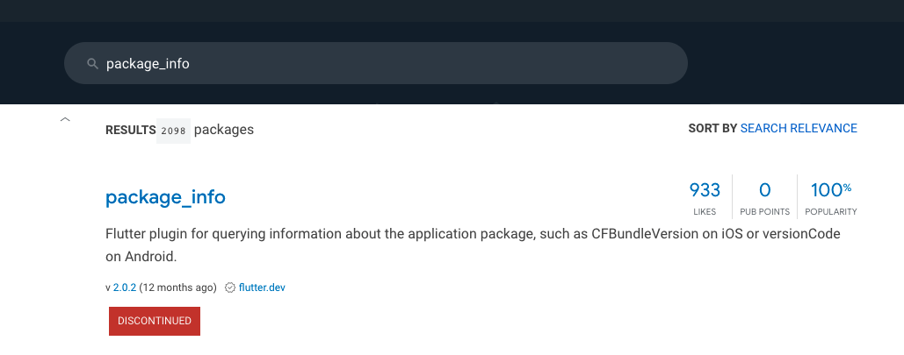
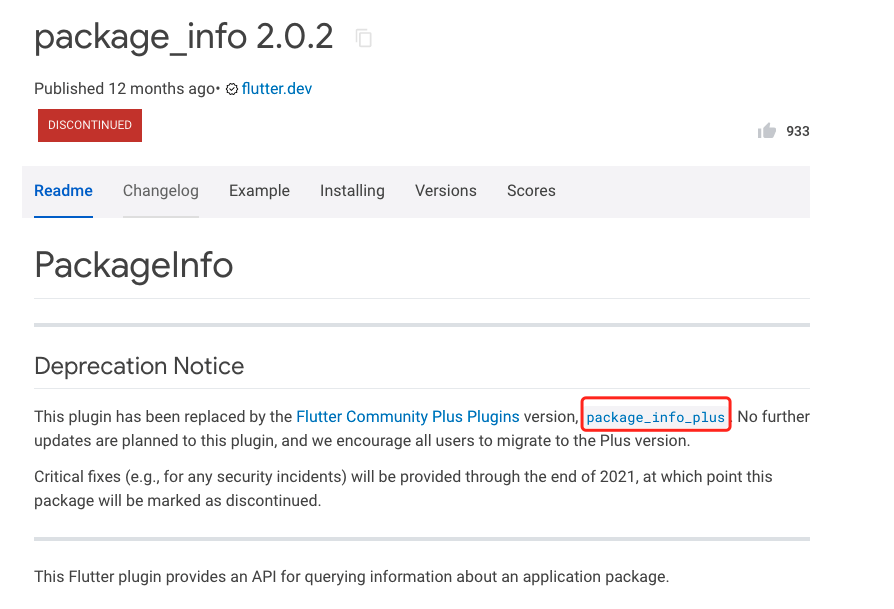

# 问题列表与解决方案

### 1.插件版本问题
一般遇到这样的错误就可能是flutter版本与当前插件版本不适配，需要更改`pubspec.yaml`内的指定插件的版本，比如这里的插件是`extended_text`，
实际所使用的版本号是`7.0.0`。

```
../../../.pub-cache/hosted/pub.flutter-io.cn/extended_text-7.0.0/lib/src/selection/extended_text_selection.dart:135:7: Error: The non-abstract class 'ExtendedTextSelectionState' is missing implementations for these members:
- TextSelectionDelegate.copySelection
- TextSelectionDelegate.cutSelection
- TextSelectionDelegate.pasteText
- TextSelectionDelegate.selectAll
  Try to either
- provide an implementation,
- inherit an implementation from a superclass or mixin,
- mark the class as abstract, or
- provide a 'noSuchMethod' implementation.

class ExtendedTextSelectionState extends State<ExtendedTextSelection>
```

- 解决方案1：修改yaml内的插件版本：
以下yaml内显示的版本列表，假如我们的flutter版本是`1.20`，那么我们就注释`extended_text: ^7.0.0`,取消注释`extended_text: 4.0.0`。
```yaml
#文本扩展显示
#  extended_text: 1.0.1  #1.17版本Flutter用这个
#  extended_text: 4.0.0 #1.20版本Flutter用这个
#  extended_text: 4.0.1 #1.22.5版本Flutter用这个
#  extended_text: ^6.0.5 #Flutter2用这个,,其他可注释
extended_text: ^7.0.0 #flutter2.5用这个,,其他可注释
```
- 解决方案2：假如我们是最新flutter，yaml文件无我们想要的版本：
这个时候我们就可以去`https://pub.flutter-io.cn/`搜索,查看版本列表，我搜索到的是`https://pub.flutter-io.cn/packages/extended_text/versions`，
  这个时候直接使用上面的与flutter版本发布时间贴近的插件版本，或者直接使用最新。
  
比如我的flutter版本是2.10.4
```
[✓] Flutter (Channel unknown, 2.10.4, on macOS 12.2.1 21D62 darwin-x64, locale
    en-CN)
    • Flutter version 2.10.4 at /opt/fvm/versions/2.10.4
    • Upstream repository unknown
    • Framework revision c860cba910 (9 weeks ago), 2022-03-25 00:23:12 -0500
    • Engine revision 57d3bac3dd
    • Dart version 2.16.2
    • DevTools version 2.9.2
    • Pub download mirror https://pub.flutter-io.cn
    • Flutter download mirror https://storage.flutter-io.cn
```
我就可以把`extended_text: ^7.0.0`注释，新增一条`extended_text: ^9.0.0`


### 2.yaml获取依赖版本错误
```
/opt/fvm/versions/2.10.4/bin/flutter --no-color pub get
Running "flutter pub get" in wechat_flutter...                  
The current Dart SDK version is 2.16.2.

Because extended_text >=9.1.0 requires SDK version >=2.17.0-0 <3.0.0 and extended_text >=9.0.0 <9.1.0 depends on extended_text_library ^9.0.0, extended_text >=9.0.0 requires extended_text_library ^9.0.0.
So, because wechat_flutter depends on both extended_text ^9.0.0 and extended_text_library ^7.0.0, version solving failed.
pub get failed (1; So, because wechat_flutter depends on both extended_text ^9.0.0 and extended_text_library ^7.0.0, version solving failed.)
Process finished with exit code 1
```
这个错误是我们改了`extended_text`插件版本，`extended_text >=9.0.0`需要依赖的是`extended_text_library ^9.0.0`，但我们yaml内写的是依赖`extended_text_library: ^7.0.0`。

- 解决方案
`extended_text_library: ^7.0.0`改为所需要的版本，这里是`extended_text_library ^9.0.0`。

### 3.获取依赖时插件包过期
```
Running "flutter pub get" in wechat_flutter...                      3.1s
The plugins `dim, flutter_image_compress, flutter_sound, image_picker, open_file, package_info, permission_handler` use a deprecated version of the Android embedding.
To avoid unexpected runtime failures, or future build failures, try to see if these plugins support the Android V2 embedding. Otherwise, consider removing them since a future release of Flutter will remove these deprecated APIs.
If you are plugin author, take a look at the docs for migrating the plugin to the V2 embedding: https://flutter.dev/go/android-plugin-migration.
Process finished with exit code 0
```
这个可以忽略不解决，不影响运行。

- 解决方案
这里以`package_info`为例子。
  
我们去`https://pub.flutter-io.cn/`搜索`package_info`插件，发现此插件停产`DISCONTINUED`
  
进入插件的详情页面`https://pub.flutter-io.cn/packages/package_info`后看到需要使用`package_info_plus`替换插件
  

这个时候直接在yaml把`package_info: 0.4.0+2`改`package_info_plus: ^1.4.0`，然后dart文件就会有导包错误和使用类错误
```
error: Target of URI doesn't exist: 'package:package_info/package_info.dart'. (uri_does_not_exist at [wechat_flutter] lib/http/api.dart:7)
```
```
error: Undefined name 'PackageInfo'. (undefined_identifier at [wechat_flutter] lib/http/api.dart:42)
```
我们直接把
```
import 'package:package_info/package_info.dart';
```
改为
```
import 'package:package_info_plus/package_info_plus.dart';
```
即可解决。


